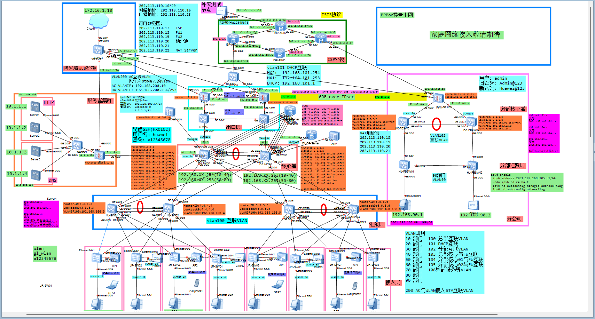

# ENSP Enterprise Network Planning

本项目是基于华为 eNSP 搭建的中大型企业网络规划与仿真实验，围绕企业园区网、总部与分部互联、出口防火墙、WLAN、IPv6、VPN 与网络安全策略等场景进行完整配置与验证。

项目采用接入层、汇聚层、核心层的企业网分层架构，模拟了多部门 VLAN 划分、网关冗余、动态路由、无线接入、服务器区、分支互联和出口安全等典型企业网络需求。仓库中保存了 eNSP 拓扑工程文件以及各设备导出的配置文件，便于复盘整体网络设计和关键配置实现。

## 网络拓扑



## 项目内容

- 企业内网三层架构规划：接入层、汇聚层、核心层
- VLAN 接入划分与 Trunk 链路规划
- Eth-Trunk 链路聚合与 MSTP 二层防环
- VRRP 网关冗余与上行链路检测
- DHCP、DHCP Relay 与 DHCPv6 地址分配
- OSPF、OSPFv3、RIP、ISIS 等动态路由配置
- WLAN 场景搭建，包括 AP 上线、CAPWAP、AC 配置下发与双 AC 备份
- 总部与分部防火墙部署、双机热备、NAT 与 NAT Server
- GRE over IPsec VPN 实现总部与分部安全互联
- IPv6、IPv6 over IPv4 GRE、MPLS、BFD 与 OSPF 联动等扩展实验
- ACL、安全策略、SSH、端口隔离等网络安全优化配置

## 仓库结构

```text
.
├── Datacom-ENSP/      # eNSP 拓扑工程及设备运行文件
├── assets/            # README 使用的拓扑图片
└── 导出配置/          # 各网络设备导出的配置文件
```

## 项目说明

该项目主要用于学习和复盘中大型企业网络从规划、搭建、调试到优化的完整过程。配置内容覆盖交换、路由、无线、防火墙、VPN、IPv6 与安全策略等多个模块，适合作为企业网络综合实验案例进行参考。

由于本项目基于仿真环境完成，部分配置和拓扑设计会受到 eNSP 设备能力和模拟器特性的限制，实际生产网络部署时需要结合真实设备型号、软件版本和业务需求进一步调整。
